# SPLxUTSPAN 2026 Data Challenge - Free Throw Prediction

Predicting basketball free throw landing outcomes (angle, depth, left/right) from full-body motion capture data. Built for the [SPLxUTSPAN 2026 Kaggle Competition](https://www.kaggle.com/competitions/spl-utspan-data-challenge-2026).

**Final Leaderboard Score: 0.006148 MSE**

🎥 **Presentation walkthrough:** [https://www.youtube.com/watch?v=W278CqHmPhU](https://www.youtube.com/watch?v=W278CqHmPhU)

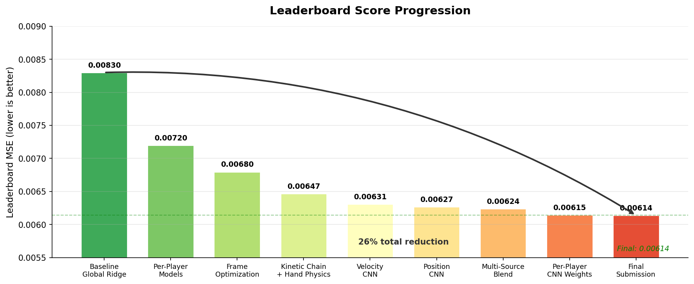

---

## The Problem

Over 1-2 seconds, a basketball player coordinates 69 tracked body joints to propel a ball toward the hoop. Given 240 frames of motion capture data at 60fps, predict three scaled outcomes describing where the ball lands: its **angle**, **depth**, and **left/right offset** relative to the hoop.

- 345 training shots, 113 test shots across 5 players
- 69 keypoints x 3 coordinates = 207 features per frame
- Evaluation: mean MSE across 3 targets (all scaled to [0, 1])

<p align="center">
  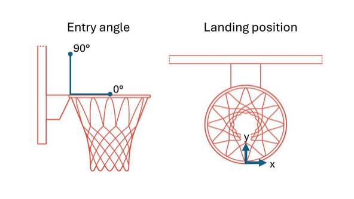
  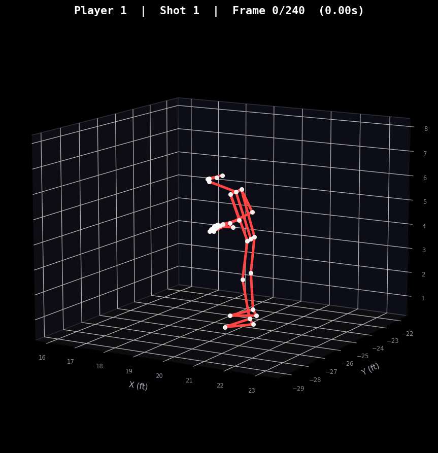
</p>

## Approach

The core insight was that every player shoots differently - not just in skill, but in mechanism. A global model averages over player-specific biomechanics and captures none of them. The final pipeline treats each player independently at every stage.

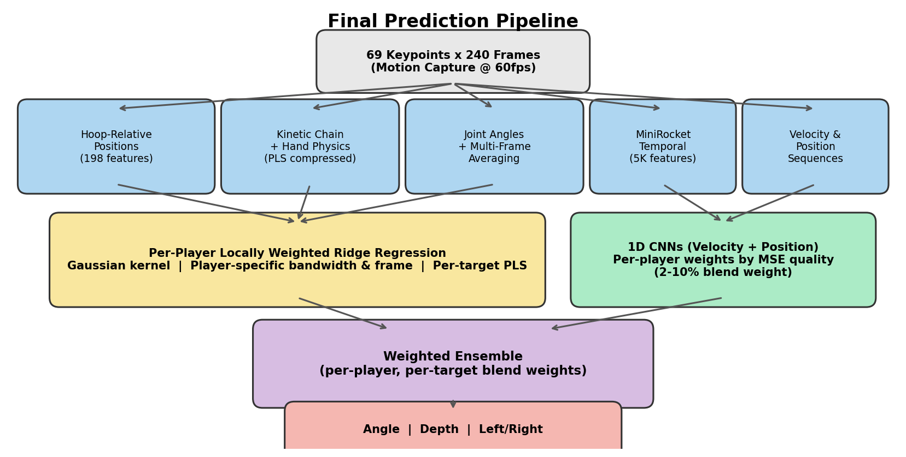

### Key Breakthroughs

**1. Per-Player Locally Weighted Regression** - Each prediction is built from the player's own data, weighted by biomechanical similarity via a Gaussian kernel. Each test shot is explained primarily by the most similar training shots from that same player. (-13% error)

Side-by-side: a low-deviation shooter (Player 3) vs. a high-deviation shooter (Player 5). Each player has a learned motor routine — deviation *from their own baseline* predicts shot error far better than raw poses.

<p align="center">
  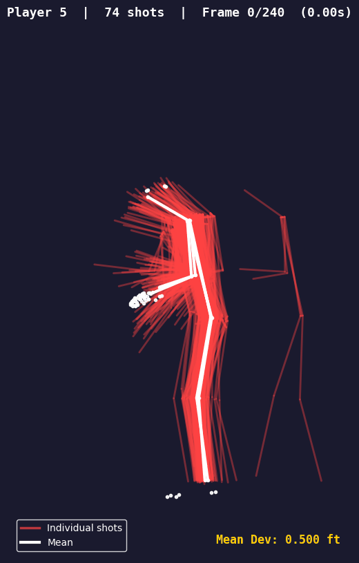
  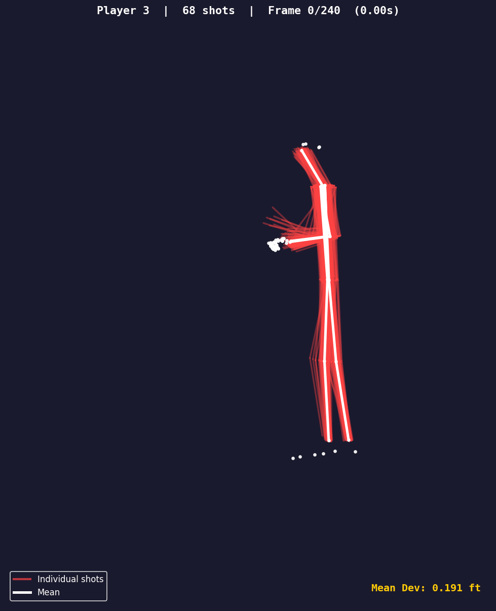
</p>

**2. Temporal Commitment Points** - Different targets are decided at different moments in the shooting motion. Depth commits ~930ms before release (forward momentum fixed mid-jump), angle commits ~550ms before (elbow geometry locked), and left/right commits after release (final wrist snap). Features are extracted at the frame each outcome is actually decided.

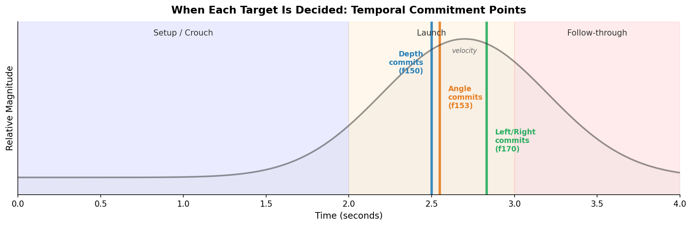

<p align="center">
  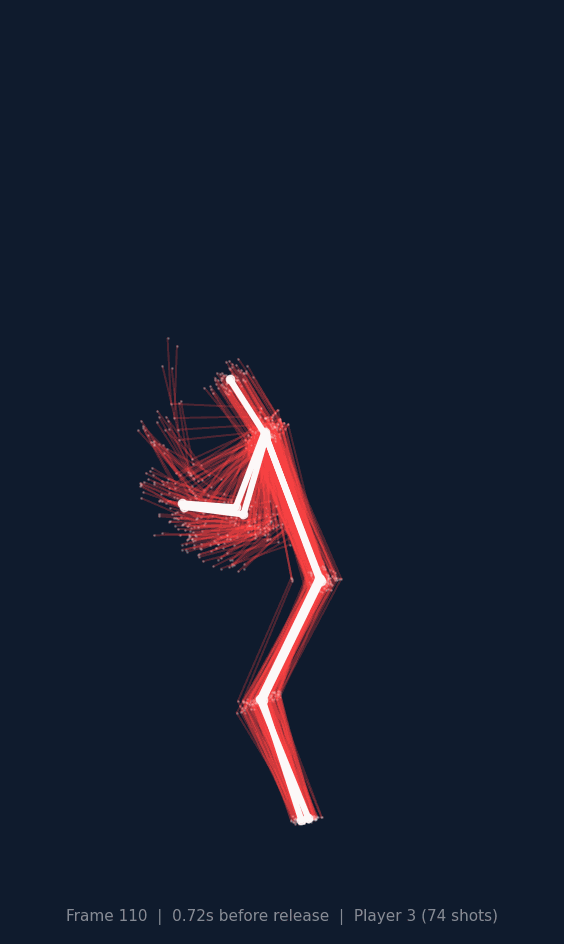
  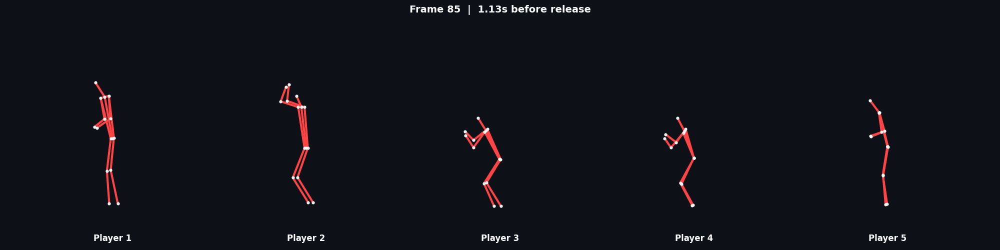
</p>

**3. Kinetic Chain + Hand Physics** - Energy flows from the ground through the hips, trunk, shoulder, and arrives at the fingertips. Features track this proximal-to-distal transfer, plus detailed finger/wrist mechanics at release: fingertip velocities, finger spread, wrist flexion, and curl across all five fingers.

**4. Velocity CNN + Position CNN** - Two 1D CNNs on the raw motion sequences: one on joint velocities (when momentum peaks, how sharply the wrist accelerates), one on joint positions (spatial trajectories). Despite sharing architecture, they capture different information - predictions correlate at only r=0.63 for depth, meaning they fail on different shots.

<p align="center">
  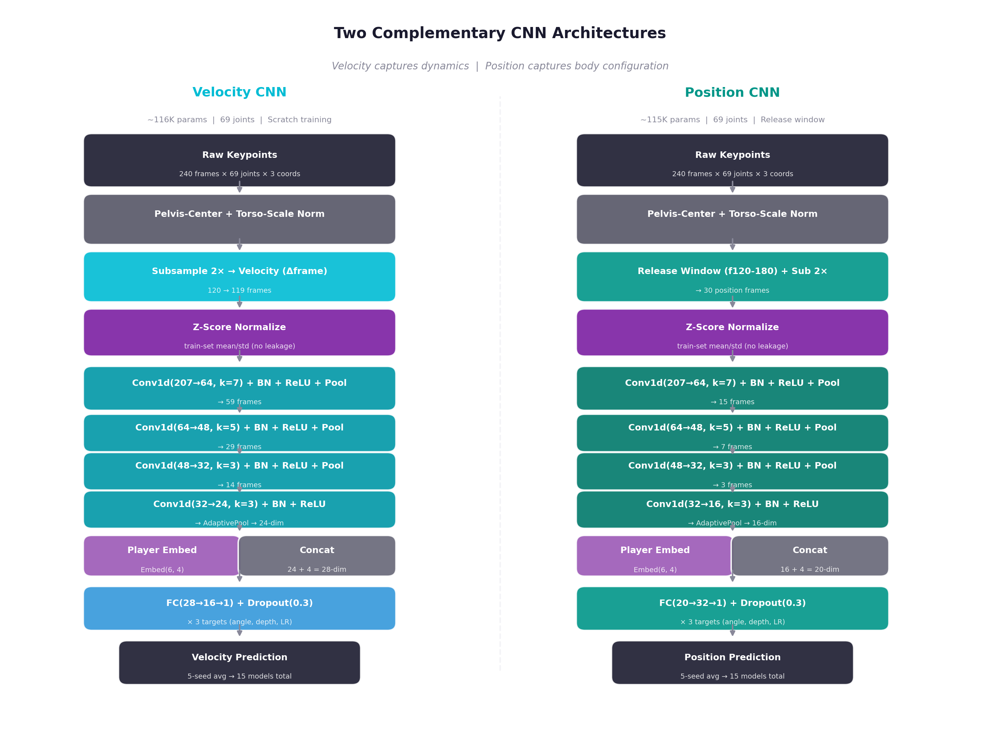
</p>

**5. MiniRocket Temporal Fusion** - 5,000 random convolutional features stamped across the full 240-frame sequence detect timing patterns no human would think to look for. Fused directly into the Ridge feature space alongside hand-crafted biomechanics, so the useful ones act as corrections.

### Ensemble Strategy

The final submission blends the Ridge pipeline (90-98% weight) with CNN predictions (2-10% weight), where CNN blend weights are set per-player based on each CNN's quality for that player. Players where the CNN performs well get more CNN signal; players where it's noisy get less.

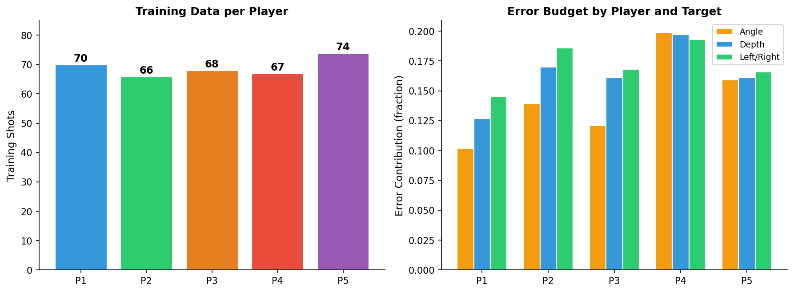

---

## Repository Structure

```
.
├── METHODOLOGY.md          # Full methodology writeup
├── SPEC.md                 # Project specification
├── Elliot_notes.md         # Personal research notes
├── data/                   # Train and test CSVs (motion capture + targets)
├── scripts/                # All experiment scripts (~470 files)
│   ├── per_example_pipeline.py          # Core Ridge pipeline
│   ├── enhanced_69joint_cnn.py          # Velocity CNN
│   ├── position_69j_cnn.py             # Position CNN
│   ├── per_player_calibration_fix.py    # Per-player CNN weight allocation
│   ├── extended_physics_features.py     # Hand physics features
│   ├── kinetic_chain_features.py        # Kinetic chain feature engineering
│   └── ...                              # ~460 other experiments
├── Research/               # Research logs, findings, and analysis
├── submission/             # 8 milestone submission CSVs
└── images/                 # README visualizations
```

## Key Scripts

| Script | What it does |
|--------|-------------|
| `scripts/per_example_pipeline.py` | Core per-player locally weighted Ridge regression pipeline |
| `scripts/enhanced_69joint_cnn.py` | 69-joint velocity CNN (1D Conv on velocity sequences) |
| `scripts/position_69j_cnn.py` | 69-joint position CNN (1D Conv on position sequences) |
| `scripts/per_player_calibration_fix.py` | Per-player CNN blend weight allocation by MSE quality |
| `scripts/extended_physics_features.py` | Hand physics: fingertip positions/velocities, spread, curl |
| `scripts/kinetic_chain_features.py` | Kinetic chain energy transfer features |
| `scripts/per_player_frame_optimization.py` | Per-player, per-target optimal frame selection |
| `scripts/unified_winning_pipeline.py` | Unified pipeline combining all winning features |

## Milestone Submissions

| Submission | LB Score | What changed |
|-----------|----------|-------------|
| 2503 | 0.006471 | Hand physics features (right hand PLS) |
| 2622 | 0.006376 | Multi-source diversity blend (4-way) |
| 2716 | 0.006343 | Added CNN + tree averaging |
| 3294 | 0.006306 | 69-joint velocity CNN at 5% weight |
| 3336 | 0.006243 | Position CNN stacked on velocity CNN |
| 3411 | 0.006234 | Added trajectory + pulse features |
| 3558 | 0.006148 | Per-player CNN weight allocation (2-10% by MSE) |
| 3655 | 0.006136 | Final submission |

## Reproducing

```bash
# Install dependencies
uv venv && uv pip install -r requirements.txt

# Run the core pipeline (generates predictions for test set)
uv run python scripts/per_example_pipeline.py

# Train velocity CNN
uv run python scripts/enhanced_69joint_cnn.py

# Train position CNN
uv run python scripts/position_69j_cnn.py

# Generate final blended submission
uv run python scripts/per_player_calibration_fix.py
```

## What Didn't Work

Not every idea improved scores. Some notable dead ends:
- **Transfer learning** from external datasets (Shot7M2, CMU MoCap) - hurt by 27%
- **Diversity-as-noise blending** (BiGRU, kNN) - diverse because they were wrong, not insightful
- **All regularization attempts** - the model was not overfitting; it was at its capability ceiling
- **MuJoCo physics simulation** - interesting exploration but no predictive signal beyond kinematics
- **Fourier rhythm features** - too many features, model too weak standalone

<p align="center">
  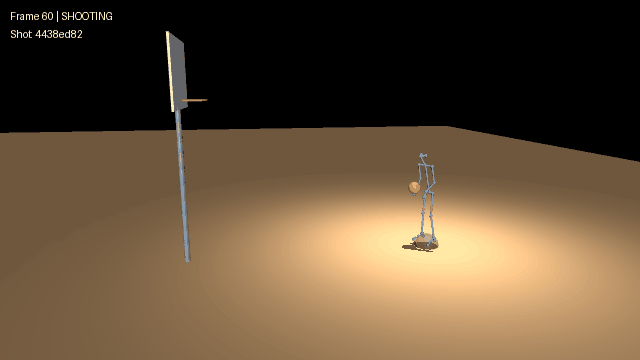
</p>

Full research logs are in `Research/`.
